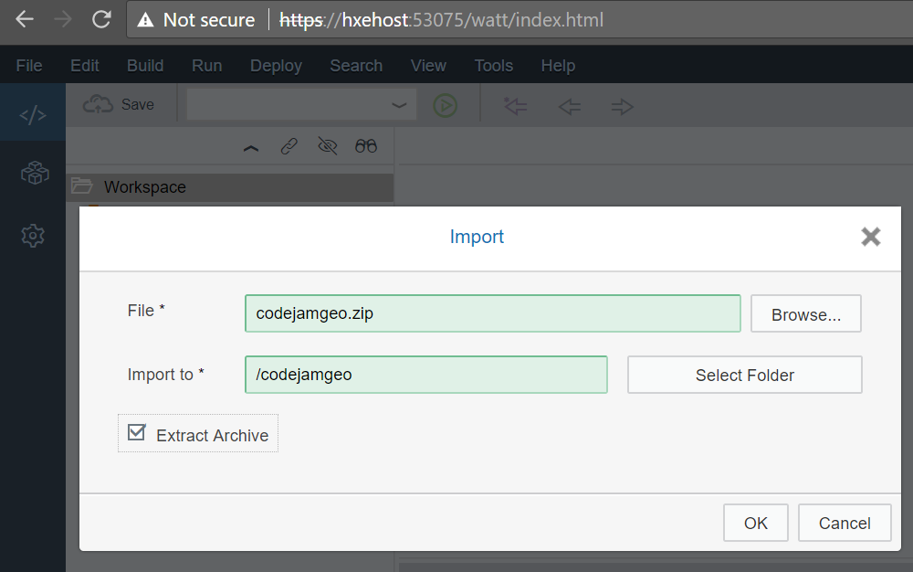
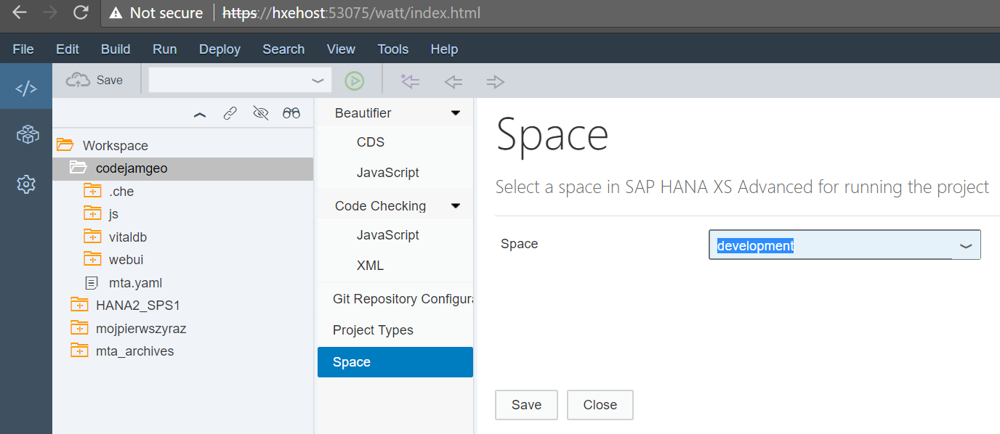
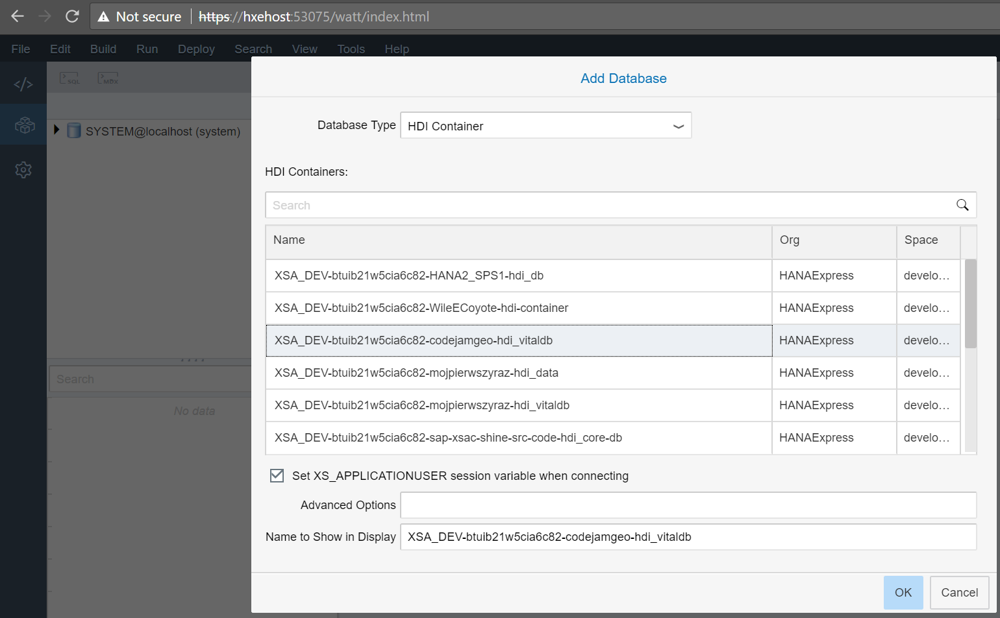
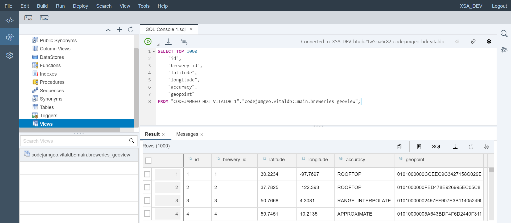
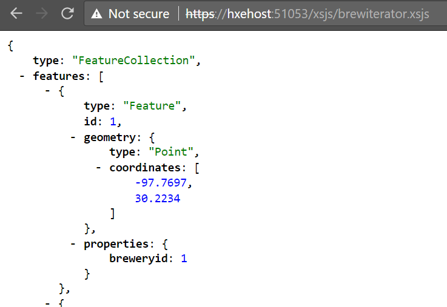
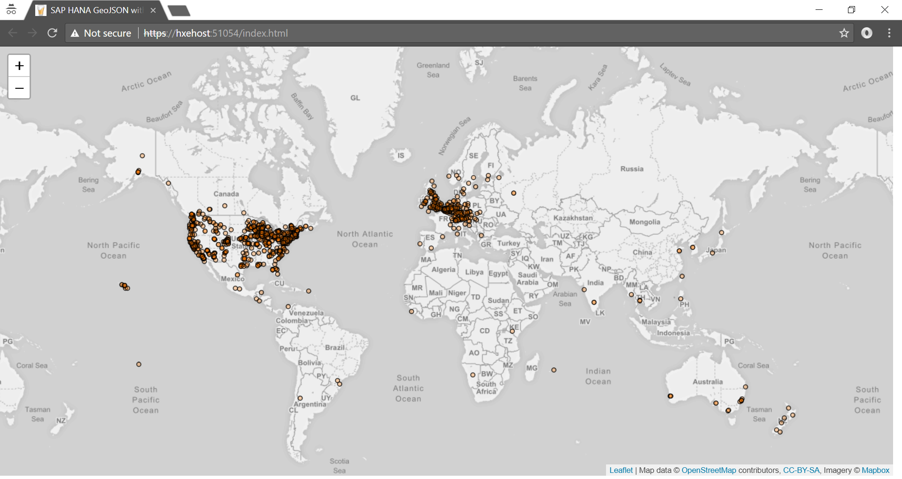

1. Logon to HANA Web IDE (here: as a user XSA_DEV)

2. Import ZIP with code



ZIP contains CSV files coming from https://openbeerdb.com/ under [Database Contents License (DbCL) v1.0](https://opendatacommons.org/licenses/dbcl/1.0/)

2. Set the space to `Development` for the project `codejamgeo`



3. Build HDB module `vitaldb`

4. Switch to the Database Explorer tool in Web IDE and add the database, like `XSA_DEV-btuib21w5cia6c82-codejamgeo-hdi_vitaldb` of the type __HDI Container__ to the explorer.



5. Check select of data from the view

```sql
SELECT *
FROM "CODEJAMGEO_HDI_VITALDB_1"."codejamgeo.vitaldb::main.breweries_geoview";
```



6. Go back to the Development tool in Web IDE and build `js` module.

7. Run it as Node.js application

8. Open the js module. You should see "Hello World of Beers!"

9. Change the URL from `index.xsjs` to `/xsjs/brewiterator.xsjs`. After successful call you should see response with the JSON payload, like this:



10. Run `webui` module as Web Application.

11. Once running in the new web browser window, you should see the map with the breweries locations.


12. Review and modify the code:
- to change map and pointer display settings
- to include the brewery name into the pop-up (you need to modify the CDS view)
- to display clusters instead of individual breweries

Cheers! Na zdrowie! Prost!
